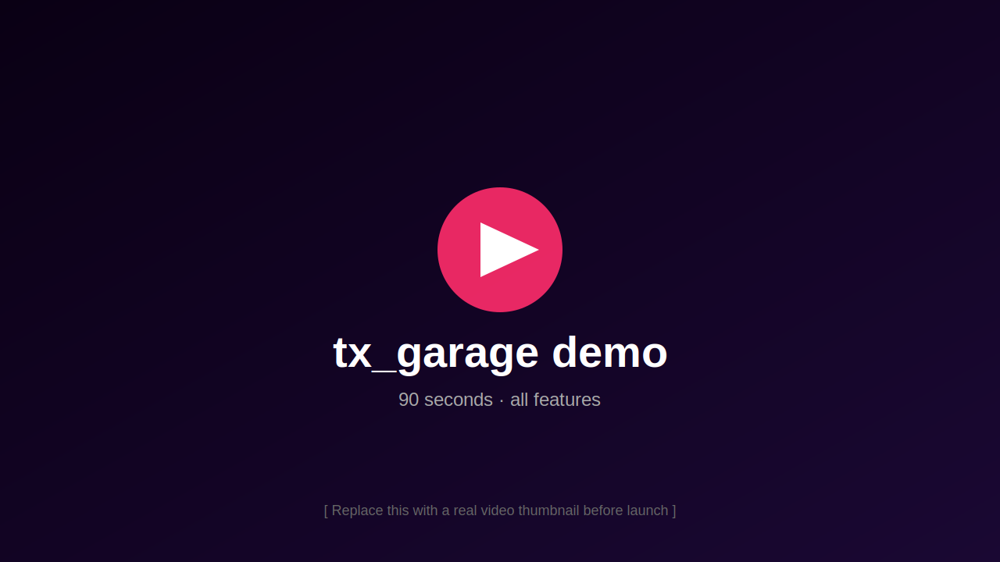
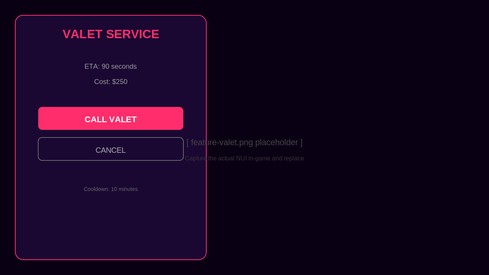
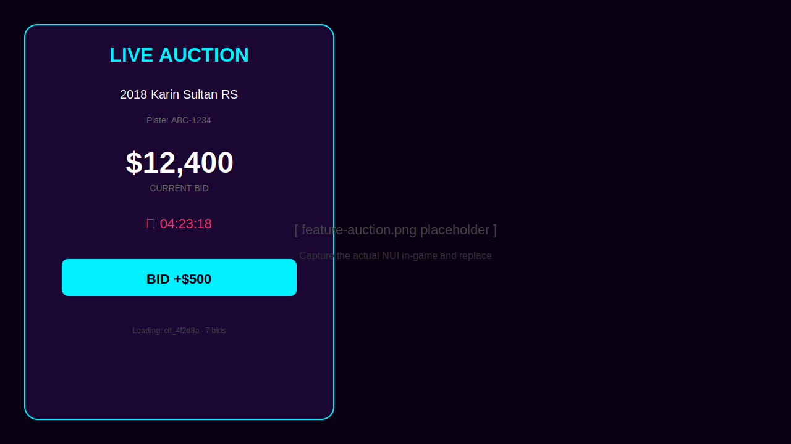
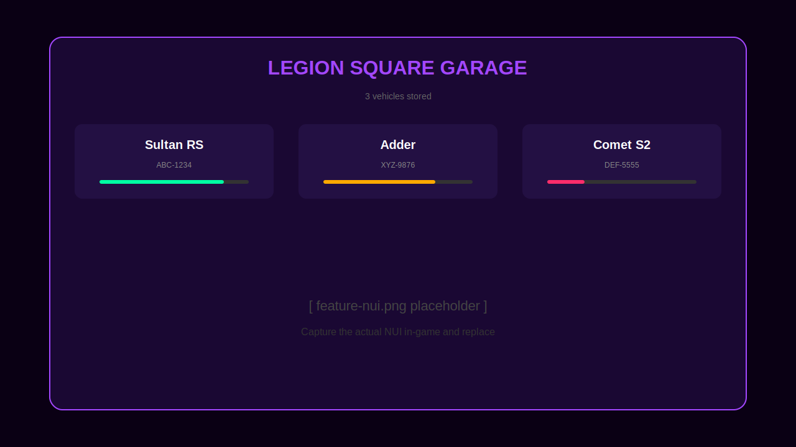

<!--
══════════════════════════════════════════════════════════════════════════════
  📸 BANNER PLACEHOLDER — REPLACE BEFORE LAUNCH
  Capture: 1920x480 hero image. Suggested composition:
    - Vice-City pink/teal gradient background
    - "tx_garage" wordmark center, large
    - Subtitle: "Valet · Impound Auctions · Modern UI"
    - Optional: 1-2 screenshots layered as a montage
  Save to: .github/assets/banner.svg
══════════════════════════════════════════════════════════════════════════════
-->
<p align="center">
  
</p>

<h1 align="center">tx_garage</h1>

<p align="center">
  <b>The first FiveM garage with valet service & live impound auctions.</b><br>
  <sub>QBCore · Qbox · ESX · 0.00ms idle · Tebex-ready</sub>
</p>

<p align="center">
  <a href="#"></a>
  <a href="#"></a>
  <a href="#"></a>
  <br>
  <a href="#"></a>
  <a href="#"></a>
  <a href="#"></a>
  <a href="#"></a>
</p>

<p align="center">
  <!-- 📸 DEMO VIDEO PLACEHOLDER — paste YouTube/Streamable embed link here -->
  <a href="https://example.com/REPLACE-WITH-DEMO-VIDEO">
    
  </a>
</p>

---

## Why tx_garage?

Most FiveM garage scripts solve the same problem the same way: store, retrieve, repeat. **tx_garage adds two systems no other paid garage on Tebex includes** — and that turns a utility script into a roleplay generator.

| | Standard garages | **tx_garage** |
|---|:---:|:---:|
| Store / retrieve vehicles | ✅ | ✅ |
| Persistent damage, fuel, mods | ✅ | ✅ |
| Job & gang garages | ✅ | ✅ |
| Police impound | partial | ✅ full |
| **Valet system** (NPC delivers your car) | ❌ | ✅ |
| **Impound auction house** (live bidding) | ❌ | ✅ |
| Multi-framework out of the box | rare | ✅ QB · Qbox · ESX |
| Server-authoritative + rate-limited | varies | ✅ every event |
| Idle performance | 0.01–0.20ms | **0.00ms** |

---

## ✨ Featured systems

### 🛎 Valet — call your car to you
<!-- 📸 SCREENSHOT — valet NUI panel + NPC arriving with vehicle. 1280x720 -->


Players call a valet from their phone or via target zone. An NPC drives the player's stored vehicle to their current location with full pathfinding AI — no teleport cheese.

- ETA range, cost, and cooldown all configurable per server
- Full payment + refund on cancel
- Anti-abuse: per-player cooldowns + database log of every call
- Distance-gated (default 500m from any garage)

<br clear="right">

### 🔨 Impound auction house — your economy sink
<!-- 📸 SCREENSHOT — auction NUI with active bid, countdown timer, and bidder list. 1280x720 -->


Vehicles unclaimed past your configured grace period (default 7 days) auto-promote to a public auction lot. Players bid live via NUI with min-increment validation.

- House cut on every winning bid (default 5%) — drains money from your economy
- Offline-safe: winners are debited at auction close even if disconnected
- Forfeit logic if winner can't cover the bid
- Drives roleplay: police impounds matter, players hunt deals

<br clear="left">

### 🎨 Modern Vice-City NUI
<!-- 📸 SCREENSHOT — main garage NUI showing vehicle list with damage indicators. 1280x720 -->


Neon gradients, smooth animations, mobile-aware layout. Designed to feel like a premium app, not a 2017 menu.

- Bundled fonts (offline / escrow-compatible — no CDN dependency)
- Damage, fuel, engine, body indicators per vehicle
- Filterable, searchable vehicle list
- Keyboard-navigable

<br clear="right">

---

## 🔥 Full feature list

**Garage core**
- Public, Private (rentable), Job, Gang, and Impound garage types
- Store / Retrieve / Transfer / Give Key actions
- Persistent vehicle damage, fuel, body, engine, mods
- Configurable per-garage spawn points, labels, blips
- Job & gang gating with grade requirements

**Valet** *(unique to tx_garage)*
- Players call a valet from anywhere within configurable range
- NPC drives the actual vehicle (not a copy) to the player
- Cost, ETA range, cooldown, cancel-refund — all configurable
- Database log for analytics and abuse detection

**Impound auction** *(unique to tx_garage)*
- Auto-promotion of overdue impounds to live auction lot
- Live NUI bidding with countdown + min-increment validation
- House cut % on every win (configurable economy sink)
- Offline-safe payment + forfeit handling
- Auction tick configurable (default 60s)

**Police integration**
- Server event `tx_garage:policeImpound` for tow-truck workflows
- Job + grade gated (works with `qbx_police`, `qb-policejob`, `esx_policejob`)
- Auto-impound abandoned/crashed vehicles (opt-in)

**Performance & safety**
- Server-authoritative — every transaction validates ownership and funds
- Per-player cooldowns on every sensitive event
- 0.00ms idle (no client tick loops, uses `ox_target` zones)
- Plate uniqueness enforced at DB layer

---

## 📦 Requirements

| Required | Why |
|---|---|
| [`ox_lib`](https://github.com/overextended/ox_lib) | Notifications, callbacks, locale system |
| [`oxmysql`](https://github.com/overextended/oxmysql) | Database driver |
| QBCore **or** Qbox **or** ESX | Framework — auto-detected |

| Optional | Why |
|---|---|
| [`ox_target`](https://github.com/overextended/ox_target) | Zone-based interaction (recommended) |
| [`ox_fuel`](https://github.com/overextended/ox_fuel) / `LegacyFuel` | Fuel persistence |
| [`qbx_vehiclekeys`](https://github.com/Qbox-project/qbx_vehiclekeys) / `qb-vehiclekeys` | Auto-key handoff on retrieve |

---

## 🚀 Installation (5 minutes)

```bash
# 1. Drop the resource into your server-data
resources/[tx]/tx_garage/

# 2. Import the schema (non-destructive — only ADDS columns + tables)
mysql -u root your_db < INSTALL.sql

# 3. Add to server.cfg
ensure tx_garage

# 4. Customize config.lua → Set Framework, Garages, Valet/Auction economics

# 5. Restart your server. Done.
```

Full install + config docs: [`INSTALL.md`](./INSTALL.md) · [`CONFIG.md`](./CONFIG.md)

---

## 🛡 Performance

| Metric | Value |
|---|---|
| Idle resmon | **0.00ms** |
| Active resmon (10 players) | <0.10ms |
| Auction processing | server-side, every 60s (configurable) |
| Memory footprint | ~2MB |

Benchmarked on Qbox + 30 players, paid live auctions every 24h cycle.

---

## 🌐 Languages

Out of the box: **English · Spanish**.
Drop a new file at `locales/<code>.lua` and set `Config.Locale = '<code>'` — everything else is automatic. Pull requests welcome.

---

## ❓ FAQ

**Will it conflict with `qb-garages` / `esx_garage` / `qbx_garages`?**
Disable the existing garage. tx_garage uses its own `tx_garage_*` columns on `player_vehicles`, so your data is preserved if you switch back.

**What happens if a player wins an auction but disconnects?**
Auction close debits their offline player record via direct SQL. If they can't cover the bid, the vehicle returns to impound and the auction is marked forfeited.

**Can players abuse valet for teleportation?**
No. The valet drives with normal AI; the call has a per-player cooldown; valet refuses if the player is in a vehicle.

**Does it work with NoPixel-style multi-character?**
Yes. Uses `citizenid` (QB / Qbox) or `identifier` (ESX), never Steam ID.

**Is it escrow-protected?**
Yes. `config.lua`, `locales/*.lua`, `shared/utils.lua`, and docs are escrow-ignored — buyers can edit those freely. Core logic is locked per Tebex policy.

**Can I disable just the auction or just the valet?**
Yes — both have a master `enabled = true/false` switch in config.

---

## 💬 Support

- **Discord** — [join the support server](https://discord.gg/REPLACE-WITH-INVITE) <!-- 📸 REPLACE: Discord invite -->
- **Tebex tickets** — open from your purchase receipt
- **Custom features** — priority for premium-tier buyers

---

## 📝 Changelog

### `1.0.0` — Initial release
- Core garage system (store / retrieve / transfer / keys)
- Valet system with NPC delivery
- Impound auction house with live bidding
- QBCore + Qbox + ESX bridge layer
- English + Spanish locales
- Modern Vice-City NUI

---

<p align="center">
  <sub>
    Made with ❤️ in California by <b>tx</b>.<br>
    <a href="https://tebex.io/REPLACE-WITH-LISTING">Buy on Tebex</a> ·
    <a href="https://discord.gg/REPLACE-WITH-INVITE">Discord</a> ·
    <a href="./CHANGELOG.md">Changelog</a>
  </sub>
</p>
